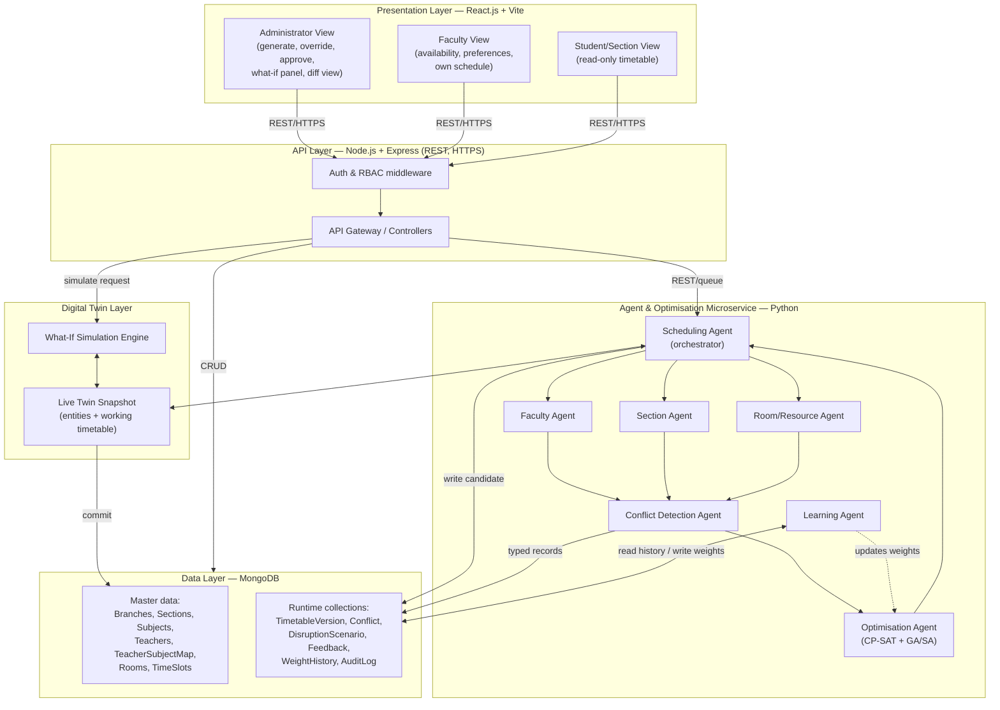
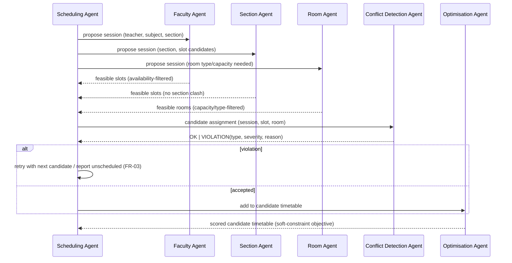
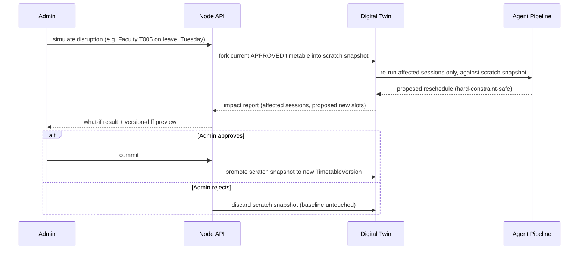
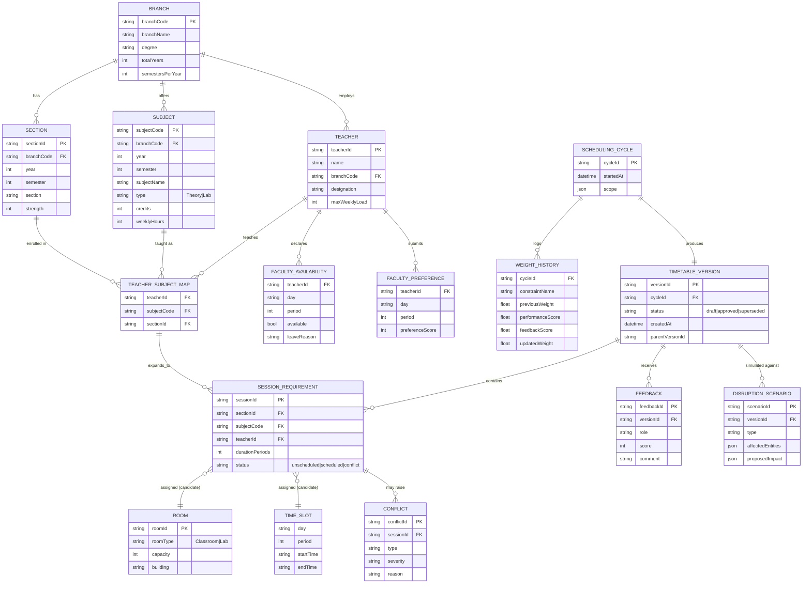
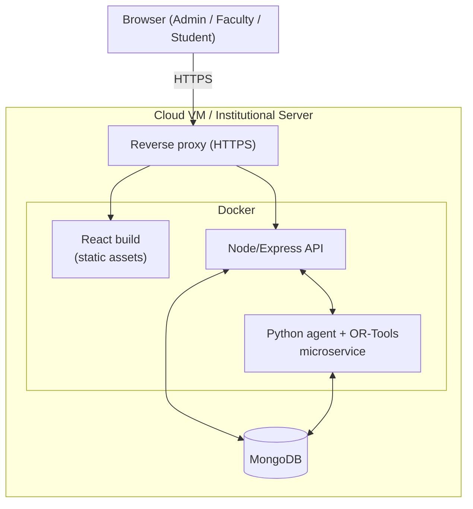

# IntelliSched AI — System Architecture

Grounded in `PROJECT_OVERVIEW.md` (synopsis + research-gap + SRS) and the actual `timetable_dataset.xlsx` schema. This is the implementation-level architecture the three source reports describe only at a proposal level.

---

## 1. Architecture Principles

1. **Layered + multi-agent**, per the synopsis: data/digital-twin → agent-coordination → optimisation → presentation.
2. **Hard constraints are non-negotiable** — enforced by validation code, never by agent negotiation or the objective function.
3. **The digital twin is the only thing agents ever write to during a solve.** The *approved* timetable in the primary store is touched only by an explicit administrator commit (SRS §3.5, FR-08).
4. **Every agent is independently testable** behind one message contract (NFR-05) — swapping the Room Agent's logic must never require touching the Faculty Agent.
5. **Every automated decision is explainable and audited**: typed/severity conflict records (FR-05/06), weight-change history with previous value (FR-11, NFR-07).
6. **Scheduling runs are scoped to an explicit term/cycle**, never the whole catalog at once (see §3 — this is a direct consequence of the dataset finding in `PROJECT_OVERVIEW.md` §7).

---

## 2. High-Level Component Diagram



---

## 3. Data Ingestion & Term Scoping (new — required by the real dataset)

`timetable_dataset.xlsx` is a **full 4-branch, 8-semester master catalog** (96 sections, 160 subjects, 480 teacher-subject-section offerings), not one cycle's live scheduling input. Total implied weekly demand is 1,728 session-hours against only 648 room-hours of supply (§7 of `PROJECT_OVERVIEW.md`), so the pipeline must **never run the whole catalog through the solver at once**.

```mermaid
flowchart LR
    XLSX["timetable_dataset.xlsx\n(master catalog)"] --> Importer["Import Service\n(one-time / on-update ETL)"]
    Importer --> Master[(MongoDB\nmaster collections)]
    Admin["Administrator"] -->|selects branch(es) + active semesters| Scoper["Term Scoper"]
    Master --> Scoper
    Scoper --> Derive["Session-Requirement Derivation\n(Subject × Section → required\nweekly session instances)"]
    Derive --> Cycle["Scheduling Cycle Input\n(scoped subset, e.g. ~40-50 sections)"]
    Cycle --> AgentPipeline["Multi-Agent Pipeline (§4)"]
```

- **Import Service**: parses the 7 sheets once into MongoDB master collections, validating referential integrity (no orphan `TeacherID`/`SubjectCode`/`RoomID`, no overlapping `TimeSlot` rows) — a mandatory data-level constraint per SRS §4.4.
- **Term Scoper**: an administrator picks which branch(es) and which semester-per-year are "active this term" (e.g., odd semesters 1/3/5/7 across all branches ≈ 48 sections). This is what actually gets handed to the agent pipeline.
- **Session-Requirement Derivation**: for each `(Subject, Section)` pair in `TeacherSubjectMap` within scope, expand `Subjects.WeeklyHours` into discrete required session instances (e.g. a 4-hour theory subject → four 1-period sessions, or two 2-period blocks if double-periods are preferred; a 2-hour lab → one contiguous 2-period block). This derived table — not the raw sheets — is the actual unit the solver schedules, and corresponds to the SRS's "Session Requirements" entity (§4.4).

---

## 4. Agent Layer Detail

| Agent | Responsibility | Reads | Writes / Emits |
|---|---|---|---|
| **Scheduling Agent** | Orchestrates the cycle: pulls scoped session requirements, sequences the other agents, drives retries on unscheduled sessions (FR-03) | Cycle input, twin state | Candidate timetable draft |
| **Faculty Agent** | Enforces faculty availability/leave (HC-5) and workload cap (`MaxWeeklyLoad`); surfaces preference satisfaction (SC-1) | Teachers, availability/leave records, preferences | Faculty-feasible slot proposals |
| **Section Agent** | Ensures no double-booking within a section (HC-3); tracks idle-gap minimisation (SC-3) | Sections, session requirements | Section-feasible slot proposals |
| **Room/Resource Agent** | Matches room type/capacity/equipment (HC-4, HC-6); tracks utilisation balance (SC-4) | Rooms, session requirements | Room-feasible slot proposals |
| **Conflict Detection Agent** | Validates every candidate assignment against all 6 hard constraints in real time as agents negotiate (differentiator vs. FET/UniTime, which validate only after a full solve) | Candidate assignments | Typed + severity-ranked `Conflict` records (FR-05, FR-06 — ≥10 conflict types) |
| **Optimisation Agent** | Runs CP-SAT for feasibility, then a genetic-algorithm (simulated annealing as fallback/complement) refinement pass against the weighted soft-constraint objective (FR-04) | Feasible candidates, current weights | Scored, ranked candidate timetable(s) |
| **Learning Agent** | Cross-cycle only: reads `WeightHistory` + `Feedback` + utilisation stats, computes updated weights (FR-11, FR-12) | Historical cycles, feedback | New `WeightHistory` entry, updated weights for next cycle's Optimisation Agent |

**Message contract** (all agents speak this envelope over an internal queue/REST call, so any one agent is replaceable — NFR-05):

```json
{
  "cycleId": "2026-T1-CSE-odd",
  "agent": "RoomAgent",
  "type": "PROPOSAL | VIOLATION | ACK",
  "payload": { "sessionId": "...", "candidateSlot": { "day": "Monday", "period": 3 }, "roomId": "CR-04" },
  "timestamp": "2026-09-18T10:00:00Z"
}
```

### 4.1 Negotiation & Conflict-Detection Sequence



---

## 5. Digital Twin & What-If Simulation

The twin is a **live, independent snapshot** of every entity (faculty, rooms, sections, current working timetable) that the agent pipeline reads/writes to during a cycle, and that an administrator can query hypothetically — **the approved baseline in `Master`/`TimetableVersion` is never touched until an explicit commit** (SRS §3.5, FR-07/08/09; this is the direct answer to Research Gap #2).



Disruption types supported (FR-08): faculty absence, room/lab unavailability, equipment failure, section size increase.

---

## 6. Data Model

Solid boxes = present in `timetable_dataset.xlsx` today. Dashed boxes = required by SRS §4.4 but generated/collected at runtime, not in the seed file (see `PROJECT_OVERVIEW.md` §7).



---

## 7. Constraint Model → Objective Function

**Hard constraints** (booleans; any `false` ⇒ candidate rejected, no exceptions — NFR-02):

```
HC1 no_faculty_double_booking(assignment)
HC2 no_room_double_booking(assignment)
HC3 no_section_double_booking(assignment)
HC4 room_capacity_ok(room, section.strength)
HC5 faculty_available(teacher, slot)      // against FacultyAvailability
HC6 room_type_matches(room, subject.type) // Lab subject → Lab room (equipment-list matching once richer room data exists)
```

**Soft constraints → weighted objective** (weights start from a configured default, then evolve — FR-12):

```
maximize  Σ wᵢ · scoreᵢ(timetable)
  score1: faculty preference satisfaction        (FacultyPreference match rate)
  score2: workload balance across faculty         (variance of sessions/teacher vs MaxWeeklyLoad)
  score3: minimised student idle gaps             (inverse of total gap-periods per section/week)
  score4: room/lab utilisation evenness           (variance of usage across Rooms)
  score5: avoidance of excessive consecutive sessions
  score6: preference for commonly favoured hours
```

`wᵢ` values live in `WeightHistory`, one row per constraint per cycle, each carrying `previousWeight → updatedWeight` so every adjustment is auditable (NFR-07).

---

## 8. End-to-End Pipeline (per scheduling cycle)

```mermaid
flowchart LR
    A["1. Term Scoper\nselect branch(es)+semesters"] --> B["2. Session-Requirement\nDerivation"]
    B --> C["3. Digital Twin\nrefresh snapshot"]
    C --> D["4. Multi-Agent\nNegotiation (§4)"]
    D --> E["5. Conflict Detection\n(real-time, every candidate)"]
    E -->|violation| D
    E -->|clean| F["6. CP-SAT Feasibility Pass"]
    F --> G["7. GA/SA Soft-Constraint\nRefinement"]
    G --> H["8. Twin What-If Validation\n(sanity re-check)"]
    H --> I["9. Present to Administrator\n(dashboard, override option)"]
    I -->|approve| J["10. Commit TimetableVersion\n(status=approved)"]
    I -->|reject/override| D
    J --> K["11. Collect Feedback +\nUtilisation Stats"]
    K --> L["12. Learning Agent\nupdates WeightHistory"]
    L -.->|next cycle| G
```



---

## 9. API Surface (representative)

| Method & Path | Purpose | Consumer |
|---|---|---|
| `POST /api/cycles` | Start a scheduling cycle with a term scope | Admin |
| `GET /api/cycles/:id/status` | Poll pipeline progress | Admin |
| `GET /api/timetables/:versionId` | Fetch a timetable version (grid view) | All roles (RBAC-filtered) |
| `PATCH /api/timetables/:versionId/sessions/:sessionId` | Manual override of one assignment (FR-15) | Admin |
| `POST /api/timetables/:versionId/approve` | Commit to approved (FR-08 boundary) | Admin |
| `GET /api/timetables/:versionId/diff/:previousId` | Version-diff view (FR-16) | Admin |
| `POST /api/simulations` | Run a what-if disruption against the twin (FR-08) | Admin |
| `GET /api/conflicts?versionId=` | Typed/severity conflict list (FR-05/06) | Admin |
| `POST /api/faculty/:id/availability` | Submit availability/leave | Faculty |
| `POST /api/faculty/:id/preferences` | Submit slot preferences (FR-14) | Faculty |
| `POST /api/feedback` | Rate a published version (FR-10) | Admin/Faculty/Student |
| `GET /api/sections/:id/timetable` | Read-only section view | Student |

Node/Express owns REST + RBAC (Auth middleware, NFR-06) and MongoDB CRUD; it calls the Python agent microservice over REST/queue for anything under `/cycles`, `/simulations`, and conflict scoring.

---

## 10. Technology Stack

| Layer | Technology |
|---|---|
| Frontend | React.js + Vite, Recharts/Chart.js for analytics/timetable-grid views |
| Backend API | Node.js + Express.js (REST, HTTPS) |
| Agent / AI microservice | Python — agents as independent modules/services communicating over the message contract in §4 |
| Constraint solving | Google OR-Tools (CP-SAT) for feasibility |
| Metaheuristic refinement | Genetic Algorithm (primary), Simulated Annealing (alternative/complement) |
| Self-learning | scikit-learn-style weight-update logic (supervised/RL-style, scoped to parameter refinement — not general autonomous learning) |
| Database | MongoDB (Community/Atlas free tier for prototype) |
| Dev tooling | Git/GitHub, Postman, VS Code, Docker (optimisation microservice containerisation) |

---

## 11. Deployment View



Prototype dev target: any machine with ≥8 GB RAM running Node.js + Python 3.x + MongoDB locally (SRS §3.4). Production target: single cloud VM or institutional server, containerised for portability (NFR-08).

---

## 12. NFR → Architecture Decision Mapping

| NFR | Architectural answer |
|---|---|
| NFR-01 Performance | CP-SAT feasibility pass sized to a *scoped* term (≈40-60 sections, not all 96) keeps solve time within minutes |
| NFR-02 Reliability | Hard constraints enforced as hard boolean gates in Conflict Detection Agent + an automated integrity check before any `approved` status is set |
| NFR-03 Usability | Dashboard hides raw data; what-if panel and diff view are the only interaction surfaces an admin needs |
| NFR-04 Scalability | Mongo schema keyed by `branchCode`/`sectionId`/`cycleId` scales from the current 96-section, 160-subject, 24-teacher catalog toward the ~150 course / ~100 faculty target without redesign |
| NFR-05 Maintainability | Agents communicate only via the JSON message contract (§4) — internal logic is swappable per agent |
| NFR-06 Security | RBAC middleware in the Node API layer scopes every query to the caller's role/section/teacherId |
| NFR-07 Auditability | `WeightHistory` and an `AuditLog` collection record every automated weight change and every manual override with previous value + timestamp |
| NFR-08 Portability | Docker-packaged Node/Python services, MongoDB — no OS-specific dependency |

---

## 13. Open Items / Assumptions Carried Into Implementation

1. **Term scoping is a new architectural component** not explicitly named in the synopsis/SRS — required because the real dataset (96 sections) cannot be scheduled as one cycle against only 18 rooms (§3, §7 of `PROJECT_OVERVIEW.md`). Needs a product decision on default scoping (e.g., odd/even semester split) before the Import Service ships.
2. **Lab equipment matching (HC-6)** is currently approximated as room-*type* match (`Lab` vs `Classroom`) because `Rooms` has no equipment list. If per-lab equipment data becomes available, extend the `ROOM` entity and the Room Agent's filter accordingly.
3. **Faculty availability/leave and preference data do not exist yet** — needed before HC-5 and SC-1 can be enforced/optimised for real; until collected, the Faculty Agent should treat all declared teaching slots as available and preferences as neutral.
4. **Session-Requirement expansion rule** (how a subject's `WeeklyHours` splits into discrete periods — e.g. 4×1-period vs 2×2-period blocks for theory, single contiguous block for labs) needs to be fixed as a configurable policy in the Scheduling Agent before the CP-SAT model is built.
5. **Double-period lab blocks**: `TimeSlots` currently models single 1-hour periods; a 2-hour lab session needs two *contiguous* periods in the same room — the solver's slot representation should model this as a block constraint, not two independent 1-hour bookings.
